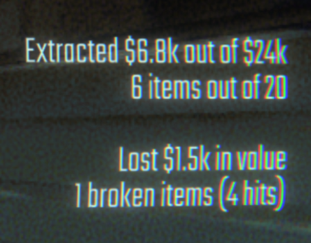

# R.E.P.O. mods!

Never done modding before, but R.E.P.O. is fun, so why not give it a shot? :>

## Post Level Summary
A non-invasive mod. No extra advantages, just cool stats! After finishing a level, it gives you:
- 💰 The amount of $ value you extracted vs. the total available.
- 📦 The number of items you extracted vs. the total available.
- 🔨 Total $ value lost due to items smashing & breaking.
- 💔 How many items got wrecked.
- 👊 How many hits items took (that made them lose value).

# Got any problems?
Drop an issue with screenshots & all the details you’ve got. I'll see what I can do! 😎
